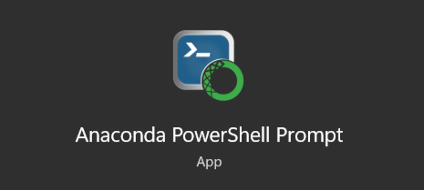
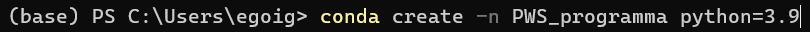
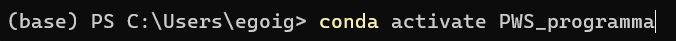
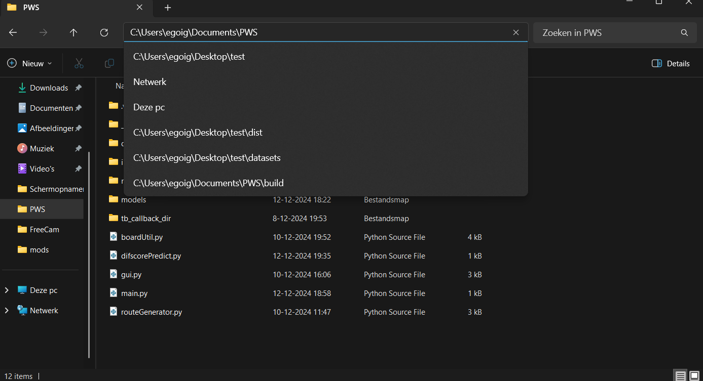
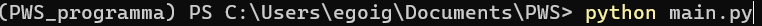

# Eerste Versie Profielwerkstuk
Siebe den Breejen en David Teeuw

# Hoe moet je het programma starten
## **DIT IS VOOR DE EERSTE KEER DAT JE HET PROGRAMMA START**
1. Download anaconda van deze website [https://www.anaconda.com/download](https://www.anaconda.com/download)
2. Open de "Anaconda PowerShell Prompt"

4. Type de volgende lines in het command prompt:
    * conda create -n {naam van het virtual environment} python==3.9
  
    * conda activate {naam van het virtual environment}
  
    * pip install tensorflow==2.10
    * pip install matplotlib
    * pip install pandas
    * pip install numpy<2
    * cd {bestandslocatie van het bestand main.py}
  
    * python main.py
   

## **DIT IS ALS JE HET PROGRAMMA WILT STARTEN VOOR EEN TWEEDE KEER**
1. Open de "Anaconda PowerShell Prompt"

2. Type de volgende lines in het command promt:
    * conda activate {naam van het virtual environment}
  
    * cd {bestandslocatie van het bestand main.py}
  
    * python main.py
   
